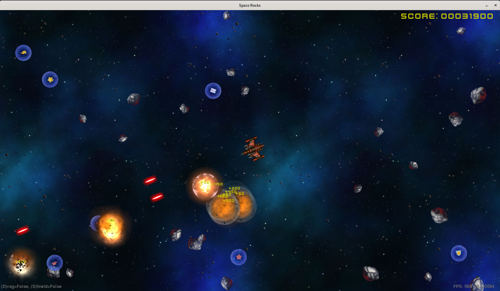
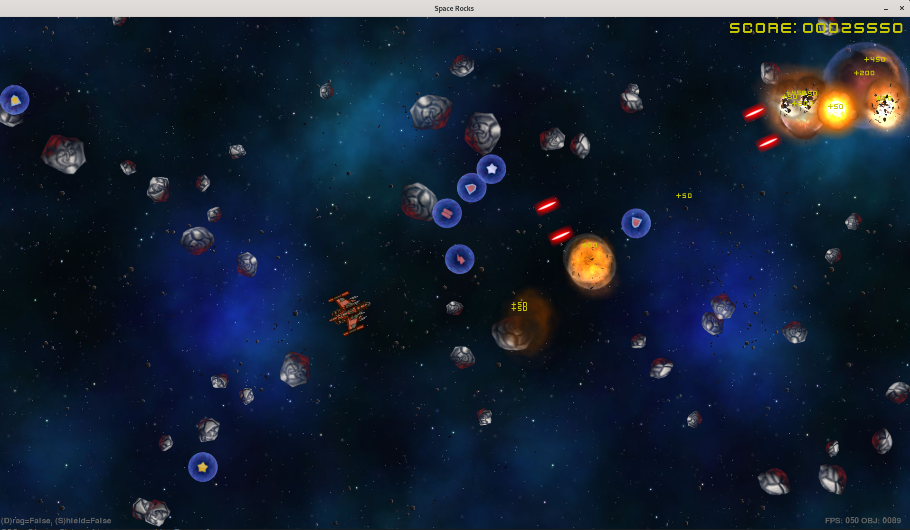

# Spacerocks

Spacerocks is a simple PyGame space shooter game where the player gets to blow up lots of rocks!

The project was originally written using the CodeSkulptor (http://www.codeskulptor.org/) web based Python development tool as
the final project of Rice University's - Introduction To Interactive Programming In Python MOOC course I completed in 2014.

As part of the Level1Techs "Devember2k17" coding event I decided to re-write the project. My goal was to port (or re-write)
the project as a stand-alone game using the PyGame library and the JetBrains PyCharm IDE.

As with a lot of my projects it's just something I did for a bit of fun and entertainment while learning Python and some
new technology along the way ... I'm still not a very "Pythonic" Python developer, but I know enough to be dangerous ;)

**Note** This is an unfinished project, I might pick it up again sometime in the future to refresh my Python skills or if I
come up with any fun new weapons to try out.

Shecks

## What it looks like...

### Videos

TODO: Record some new videos of the current state of play ...

### Screenshots

## Original Game:

### Videos

[Game Play](https://www.youtube.com/watch?v=C52dIKihVuY)
[Weapon Testing](https://www.youtube.com/watch?v=m-vDMGEEwo)
[More Weapon Testing](https://www.youtube.com/watch?v=14Cpc2aiFjA)
